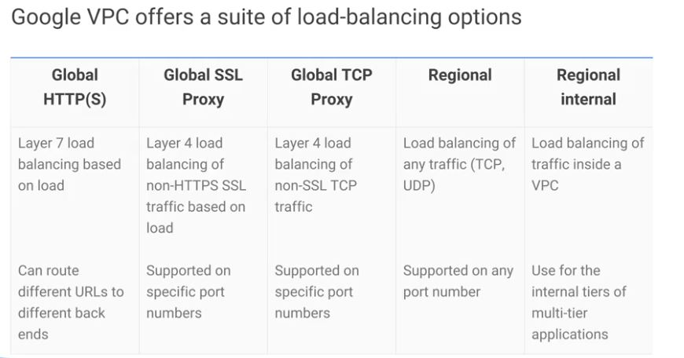
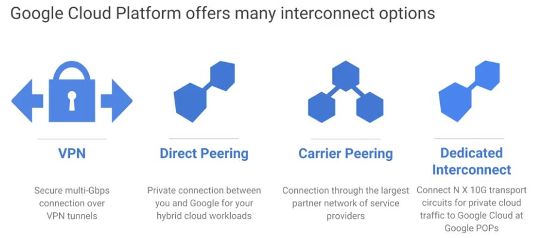

----
## You control the topology of your VPC network
* Use its route table to forward traffice within the network, even across subnets.  

Much like physical networks, VPCs have **routing tables.**
* We use these to forward traffic from one instance to another instance within the same network
 - even across sub-networks and
 - even between GCP zones without requring an external IP address

> VPCs routing tables are built in, you don't have to provision or manage a router.

----
## You control the topology of your VPC network
* Use its firewall to control what network traffic is allowed

VPCs give you a **global distributed** firewall.  
* You can control to restrcit access to instances both incoming and outgoing traffic.
* You can define firewall rules in terms of metadata tags on compute engine instances. For example:
 - you can tag all your web servers with say, *web*
 - you can write a firewall rule saying that traffic on ports 80 or 443 is allowed into all VMs with the *web* tag, no matter what their IP address happens to be. 

> A firewall instance is built in, you don't have to provision or manage it for GCP.

----
## You control the topology of your VPC network
* Use Shared VPC to share a network, or individual subnets, with other GCP projects.
* Use **VPC Peering** to interconnect networks in GCP projects.  

**VPC Peering** - a relationship between two VPCs so that they can exchange traffic.  

On the other hand, if you want to use the full power of **IAM** to control who and what in one project can interact with a VPC and another, that's what **shared VPC** for.

----

> how do your customers get to your application when it might be provided by four VMs one moment and 40 VMs at another? **Cloud Load Balancing** is the answer.

## Cloud Load Balancing
* is a fully distributed software-defined managed service for all your traffic.
* Because the **load balancers** do not run in VMs you have to  manage, you do not have to worry about scaling or managing them.
* You can put Cloud Load Balancing in front of all your traffic, HTTP and HTTPS, other TCP and SSL traffic, and UDP traffic too.

## With global **Cloud Load Balancing**, your application presents a single from-end to the world
1. Users get a single, global anycast IP address.
* Traffic goes over the Google backbone from the closest point-of presence to the user.
* Backends are selected based on load.
* Only healthy backends receice traffic.
* No pre-warming is required.

> With Cloud Load Balancing, a single anycast IP front ends all your backend instances in regions around the world.

> It provides cross region load balancing, including automatic multi-region  failover, which gently moves traffic in fractions if backends become unhealthy

> Cloud Load Balancing reacts quickly to changes in users, traffic, backend health, network conditions, and other related conditions.

> If you need cross regional load balancing for a web application, use HTTPS load balancing. 

> For **Secure Sockets Layer**(SSL) traffic that is not HTTP, use the global SSL proxy load balancer.

> If it is other TCP traffic that does not use Secure Sockets Layer, use the global TCP proxy load balancer. Those two proxy services only work for a specific port numbers,
and they only work for TCP.

> If you want to load balance UDP traffic or traffic on any port number, you can still load balance across a GCP region with the regional load balancer. 

### Common points
What all those services have in common is that:  
they're intended for traffic coming into the Google network from the internet.

### But what if you want to load balance traffic inside your project? (Say, between the presentation layer and the business logic layer of your application?)
For that, use the internal load balancer.  
It accepts traffic on a GCP internal IP address and load balances it across compute engine VMS.

----
> One of the most famous Google services that people don't pay for is **8.8.8.8** which provides a public domain name service to the world.

### DNS
* is what translates internet host names to addresses

Google has a highly developed DNS infrastructure.
- It makes 8.8.8.8 available so that everybody can take advantage of it.

## **Cloud DNS** is highly available and scalable
* Create managed zones, then add, edit, delete DNS records

 - It has low latency and high availability 
 - It is a cost effective way to make your applications and services available to your users.
 - The DNS information you publish is served from redundant locations around the world.

----
> Cloud DNS is also programmable. 

## **Cloud DNS** is highly available and scalable
* Programmatically manage zones and records using TESTful APU or command-line interface

> You can publish and manage millions of DNS zones and records using the GCP console, the command line interface or the API.

----
> Google has a global system of edge caches.

> You can use this system to accelerate content delivery in your application using **Google Cloud CDN**.

## Cloud CDN (Content Delivery Network)
* Use Google's globally distributed edge caches to cache content close to your users

### Benefits of CDN
* Your customers will experience lower network latency.
* The origins of your content will experience reduced load.
* you can save money too. 

### How to enable CDN?
Once you've set up the HTTPS load balancing, simply enable Cloud CDN with a single checkbox. 

----
## Cloud CDN (Content Delivery Network)
* Or use CDN Interconnect if you'd prefer to use a different CDN

> There are lots of other CDNs out there. What if you're already using one?

> Chances are, your CDN is a part of GCPs, CDN interconnect partner program and you can continue to use it.

----
> Lots of GCP customers want to interconnect their **other networks** to their **Google VPCs** such as **on-premises networks** or their networks in other clouds.

## Choices

### VPN (Virtual Private Network)
* Many customers start with a Virtual Private Network connection over the internet using the **IPSEC protocol**.

* To make that dynamic, they use a GCP feature called **cloud router**.

**Cloud router** 
* lets your other networks and your Google VPC exchange route information over the VPN using the **Border Gateway Protocol**.

> For instance, if you add a new subnet to your Google VPC, your on-premises network will automatically get routes to it.

### Direct Peering
Because of security concerns or because they need more reliable bandwidth, some customers don't want to use the internet:

They can consider peering with Google using direct peering.

**Peering** 
* means putting a router in the same public data center as a Google point of presence and exchanging traffic.

> Google has more than 100 points of presence around the world.

### Carrier Peering
Customers who aren't already in a point of presence can contract with a partner in the carrier peering program to get connected.

**One downside of peering** -  it isn't covered by a Google service level agreement

### Dedicated Interconnect
Customers who want the highest up times for their interconnection with Google should use **dedicated interconnect** in which customers get one more direct private connections to Google. 

----
If these connections have topologies that meet Google's specifications, they can be covered by up to a **99.99** percent SLA.

These connections can be backed up by a **VPN** for even greater reliability. 