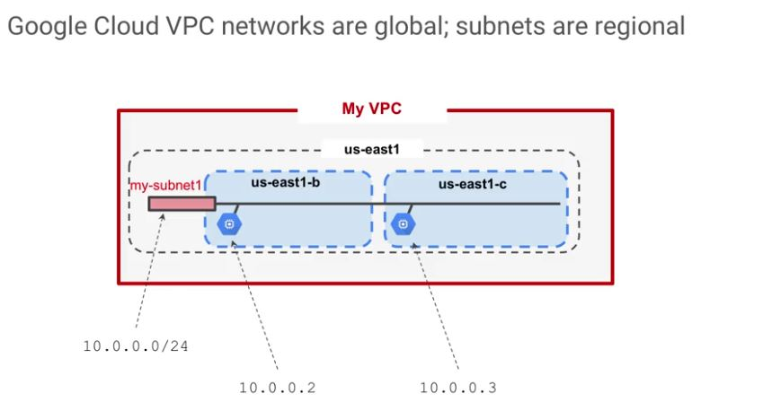

## Virtual Private Cloud Networking
* Each VPC network is contained in a GCP project
* You can provision Cloud Platform resources, connect them to each other, and isolate them from one another

> You can segment your networks, use firewall rules to restrict access to instances, and create static routes to forward traffic to specific destinations.

## Notes
* The VPC networks you defined have global scope. They can have subnets in any GCP region worlwide and subnets can span the zones that make up a region.  
* This architectue makes it easy for you to define your own network layout with global scope. You can also have resources in different zones on the same subnet.
* You can dynamically increase the size of a subnet in a custom network by expanding the range of IP addresses allocated to it. Doing that does not affect already configured VMs.

In this example, your VPC has one network.
So far, it has one subnet defined in GCP us-east1 region.
Notice that it has two compute engine VMs attached to it.
They are neighbors on the same subnet even though they are in different zones.
You can use this capability to build solutions that are resilient but still have simple network layouts. 

Question: True or false? In Google Cloud VPCs, subnets have regional scope.

Answer: True - VPC subnets can span the zones that make up a region. This is beneficial because your solutions can incorporate fault tolerance without complicating your network topology.

Question: True or false: If you increase the size of a subnet in a custom VPC network, the IP addresses of virtual machines already on that subnet might be affected.

Anser: False - You can dynamically increase the size of a subnet in a custom network by expanding the range of IP addresses allocated to it. Doing that doesn’t affect already configured VMs.