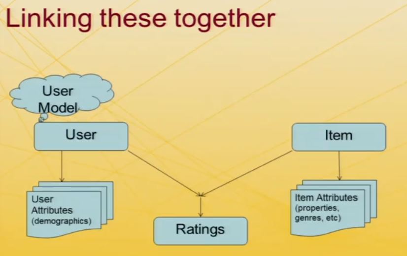

----
# Taxonomy of Reconmmenders

----
## Analytical Framework

### Dimensions of Analysis
* Domain
* Purpose
* Recommendation Context
* Whose Opinions
* Personalization Level
* Privacy and Trustworthiness
* Interfaces
* Recommendation Algorithms

----
## Domains of Recommendation
> Need to know what is being recommended
* Content to Commerce and Beyond
 - News, information, "text" - Are we recommending news articles?
 - Products, vendors, bundles
 - Matchmaking (other people)
 - Sequences (e.g. music playlists)
> Are we recommending news articles?
> Are we recommending products?
> Are we recommending bundles, where instead of a particular product we are saying, look if customers are interested in product X, we can give customers a deal if you buy X, Y, and Z together.
> Are we match making, where we are recommending people to other people?
> Are we recommending sequences, like a music playlist? Where it may not just be the set of songs, but that the order of those songs may matter

* Other particularly interesting property
 - New items (e.g. movies, books, ...)
 - Re-recommend old ones (e.g. groceries, music)
 
----
## Purposes of Recommendation
* The recommendations themselves
 - Sales
 - Information
* Education of user/customer
* Build a community of users/customers around products or content
 
----
## Recommendation Context
* What is the User doing at the time of recomendation?
 - Shopping
 - Listening to Music
 - Hanging out with other people
 
> If the system knows I am mostly risk averse, it will just play music that has a good reason to believe I will like. If it knows I am into seeking out new experiences, it might mix in more riskier and unfamiliar music.
> If the system knows that I am hanging out with other people, it may make a recommendation for groups rather than for individuals

* How does the context constrain the recommender?
 - Groups, automatic consumtion (VS suggestion), level of attention, level of interruption
> All of these things can affect the level of attention or the degree to which the user if willing to accept an interruption
 
----
## Whose Opinion?
* "Experts"
* Ordinary "phoaks" (everybody)
* People like you

----
## Personalization Level
* Generic/ Non-Personalized
 - Everyone receives same recommendations
* Demographic
 - Matches a target group
* Ephemeral
 - Matches current activity
* Persistent
 - Matches long-term interest
 
----
## Privacy and Trustworthiness
* Who know what about me?
 - Personal information revealed
 - Identity
 - Deniability of preferences
* Is the recommendation honest?
 - Biases ("business rule") built-in by operator - eg Never recommend something that's out of stock
 - Vulnerability to external manipulation
 - Transparency of "recommmenders"; Reputation
 
----
## Interfaces
* Types of Output
 - Predictions
 - Recommendations
 - Filtering
 - Organic vs. explicit presentation - Agent/Discussion Interface '
* Types of Input
 - Explicit
 - Implicit
 
----
## Recommendation Algorithms
1. Non-Personalized Summary Statistics
* Content-Based Filtering
 - Information Filtering
 - Knowledge-Based
* Collaborative Filtering
 - User-User
 - Item-Item
 - Dimensionality Reduction
* Others
 - Critique / Interview Based Recommendations
 - Hybrid Techniques
 
----
## From the Abstract to Specific
* Basic Model
 - Users
 - Items
 - Ratings
 - (Community)
 
Inline-style: 

